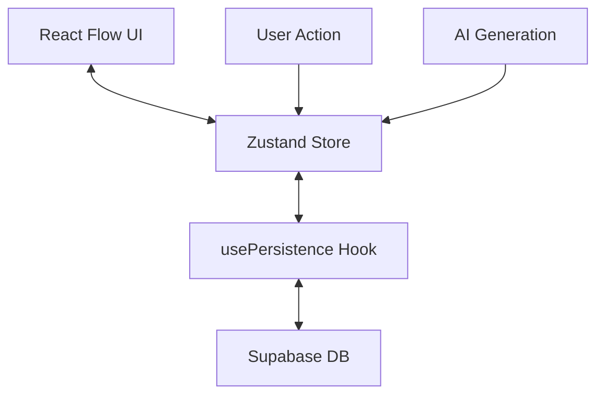

# Architecture & Foundation 🏗️

This document outlines the core architectural decisions and data flow for the Spatial Branching AI application.

## 1. System Overview

The application is built on three main pillars:

1. **Canvas Engine**: React Flow for spatial rendering.
2. **State Management**: Zustand (with Immer) for reactive state.
3. **Persistence Layer**: Supabase for cloud syncing.

## 2. State Management (`canvas-store.ts`)

We use **Zustand** for global state. It holds the "source of truth" for the active session.

- **Nodes**: Array of `ConversationNode` objects.
- **Edges**: Array of React Flow `Edge` objects.
- **Metadata**: `treeId`, `treeName`, `syncStatus`.

### Key Actions

- `createChildNode`: Calculates position and adds a new node + edge.
- `updateNode`: Updates content or role.
- `loadGraph`: Replaces the entire state when loading a tree.

## 3. Persistence Layer (`usePersistence.ts`)

The critical "healthy foundation" of the app. It handles the synchronization between the local store and the remote database.

### Strategy: Debounced Auto-Save

1. **Change Detection**: The hook subscribes to `nodes` and `edges` changes.
2. **Debounce**: Waits for 1 second of inactivity.
3. **Mutex Lock**: Uses `isSavingRef` to prevent overlapping saves (Race Condition Protection).
4. **Upsert Logic**:
    - **Trees**: Updates timestamp using `treeId`.
    - **Nodes**: Uses `UPSERT` to update existing nodes or insert new ones.
    - **Edges**: Uses `UPSERT` (with `onConflict`) to handle connections idempotently.
    - **Cleanup**: Deletes nodes that are no longer in the local state.

### Failure Handling

- If a save fails, `syncStatus` is set to `error`.
- Console logs detailed Supabase errors.
- The "Safe Lock" prevents "Duplicate Key" errors by strictly serializing network requests.

## 4. Database Schema

### `trees`

- `id`: UUID (Primary Key)
- `name`: Text
- `updated_at`: Timestamp

### `nodes`

- `id`: UUID (Primary Key)
- `tree_id`: Foreign Key
- `position_x`, `position_y`: Float
- `data`: JSONB (Contains `{ role, content, branchContext }`)

### `edges`

- `source_id`, `target_id`: UUIDs
- `tree_id`: Foreign Key
- **Constraint**: Unique composite key on `(source_id, target_id)` to ensure graph integrity.

## 5. AI Integration

- **Provider**: OpenRouter (access to various LLMs).
- **Flow**:
    1. User clicks "Generate".
    2. `useChat` hook sends context to `/api/chat`.
    3. Server proxies request to OpenRouter.
    4. Response is streamed via Server-Sent Events (SSE).
    5. `onToken` callback updates the node content in real-time.

---

*This architecture is designed to be scalable, ensuring that even with hundreds of nodes, the state remains consistent and the persistence robust.*
